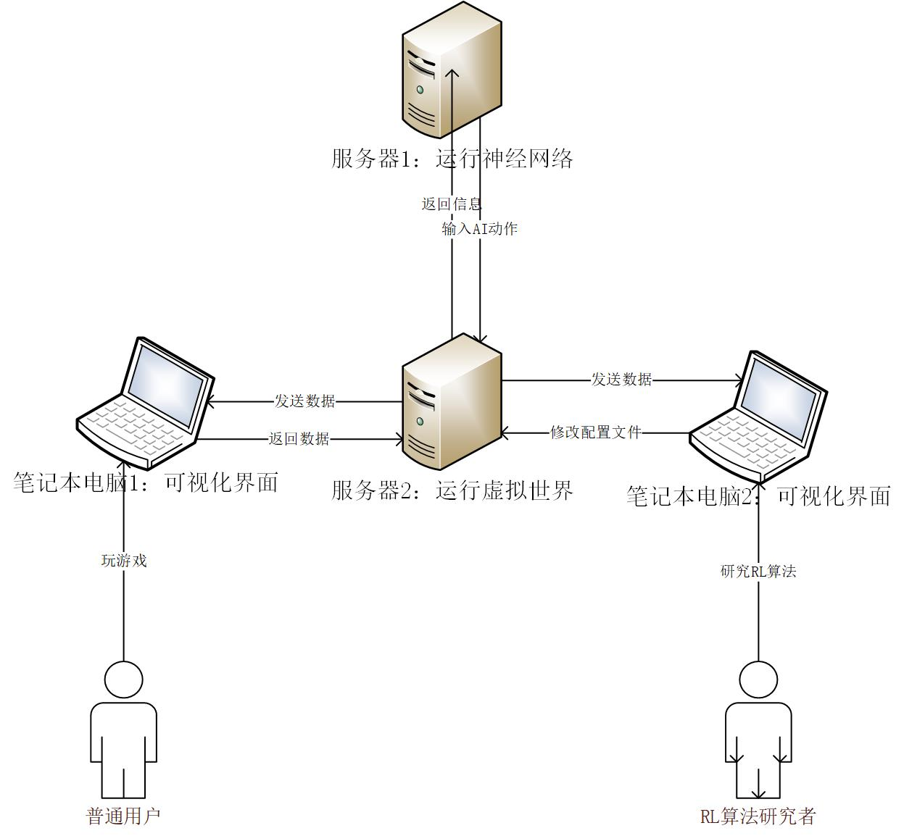

# 设计概要

## 系统整体结构

### 1、系统框架设计

采用C/S模式，分为三大模块：神经网络、虚拟世界、客户端（可视化）。

神经网络、客户端都只与虚拟世界通信，这里规定下模块之间的通信内容：

#### （1）神经网络与虚拟世界通信协议

神经网络传递的信息为虚拟世界中智能体的指令信息，指令格式为：

| index | action type | action param1 | action param2 |

虚拟世界除了返回智能体自身的信息外，还要给出智能体可见范围内的所有角色的信息

（待填）

#### （2）客户端与虚拟世界通信协议

客户端发送给虚拟世界的信息和神经网络的一致，采用相同格式

虚拟世界返回给前端的信息：

a.角色信息

b.移动信息

### 2、虚拟世界功能模块设计

根据目前的功能需求，可以分为九个模块：

（1）移动

（2）攻击

（3）吃/使用消耗品

（4）饮水

（5）拾取

（6）合成

（7）装备

（8）解除装备

（9）丢弃物品

由于模块之间存在相似的操作，未来的动作可能会使用到重复的操作，为了降低这些功能模块之间的耦合度，从代码结构和现实世界的角度重新划分这些模块：

（1）角色：角色模块主要是定义虚拟世界中各类Character的属性与接口，这里将虚拟世界中的各类生物、物品、地形都统一称为Character

（2）时间：时间模块的主要功能是管理虚拟世界中和时间密切关联的一些概念，例如：时间类buff、生物复活、地图场景等

（3）地图：地图模块囊括了地图上所有的Character，提供地点访问和障碍检测的接口

（4）指令：指令模块负责解释并执行指令，根据指令执行的结果产生相应的事件

（5）状态：状态模块用于生物的智能化，主要的功能包括状态转移和生成生物指令

（6）事件：事件模块主要负责处理由指令模块产生的事件，这些事件往往需要对其他模块进行修改

## 角色模块概要

为了方便起见，将虚拟世界中的生物、物品、地形都统称为角色（Character），角色是虚拟世界中可操作的对象的总集合。

Object指代除了地形之外的Character

设计理念：

（1）地形：地形在虚拟世界中不可改变，因此自身属性是固定的，为了区分不同的地形，需要给出地形的类型属性。

（2）物品（材料、食物、工具）：物品经由生物掉落或者合成得到，除了区分不同类型的物品外，还要区分同种类型的不同物品，所以需要序号属性来进行区分，此外物品可以被生物使用，根据物品种类的不同，提供不一样的效果；

（3）生物：生物则是虚拟世界中最为活跃的角色，在游戏过程中属性会被频繁地修改，然而有部分属性却是十分稳定，比如：类型、序号，经由这两个属性唯一地确定一个角色，因此需要将稳定的部分和变化的部分进行分离。

## 时间模块概要

（1)buff：时间在现实世界中是最为重要的概念之一，虚拟世界中使用时间模块来模拟时间这一重要概念。按照主流游戏的设定，时间类的buff超过作用时间后就会从buff栏消失；

（2）物品：地图上的物品有存在时间，超出这个时间物品就会消失；

（3）场景：地图的场景会随着时间变化；

（4）复活：死亡的生物经过一段时间会在某些固定点重生。

## 地图模块概要

在虚拟世界中存在障碍物，采用如下设定：默认各类物品都是可以穿越的，部分地形禁止穿越，生物之间不可重叠。

根据上述的设定分析，生物的移动不会引起地形和物品地图的变化，地形、物品在地图上的变化也不会影响到生物，生物、地形、物品在地图上是相互独立的，因此将地图模块细分为三个子模块：

（1）生物地图

（2）地形地图

（3）物品地图

## 指令模块概要

指令模块用于完成游戏玩家和神经网络的各类指令，并为每一类指令进行编码表示。

目前的指令有9个指令，这些指令以向量的形式表示，除了指令编码，还应该有对应的指令参数，指令参数的功能是告知系统指令的执行方法。

## 状态模块概要

（1）状态转移：状态模块用于控制生物的行为，每个游戏循环中，生物会根据自身的状态以及周围环境做出决策，切换到下一个状态。

（2）状态决策：根据自身的状态做出决策，生成本轮的生物指令并执行。

